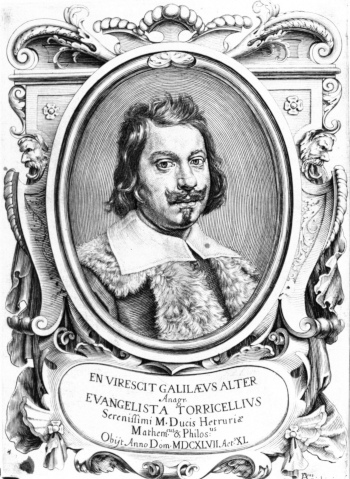
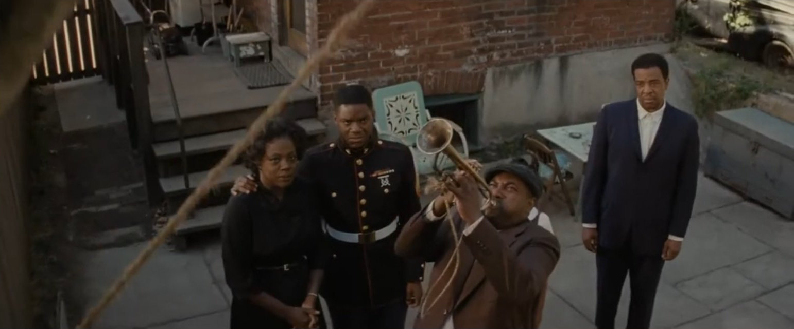
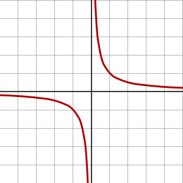
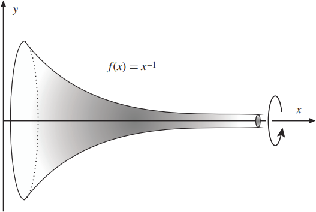

<!-- spell-checker: disable -->

# Η τρομπέτα του Τοριτσέλι και τα τουβλάκια του Γαβριήλ

Η ιστορία μας περιλαμβάνει δύο εκ πρώτης όψεως άσχετα μεταξύ τους στοιχεία.

Ο *Γαβριήλ* κατά το παρελθόν ήταν ένας πολυάσχολος αρχάγγελος. Παρουσιάστηκε στον προφήτη *Δανιήλ* και στη γυναίκα του *Μανωέ*, στον ιερέα *Ζαχαρία* και φυσικά στη *Μαριάμ*, σε όλες τις περιπτώσεις για να αναγγείλει μία [επικείμενη γέννηση](https://el.wikipedia.org/wiki/%CE%91%CF%81%CF%87%CE%AC%CE%B3%CE%B3%CE%B5%CE%BB%CE%BF%CF%82_%CE%93%CE%B1%CE%B2%CF%81%CE%B9%CE%AE%CE%BB)! Φήμες λένε, ότι το έκανε χρησιμοποιώντας τη σάλπιγγά του.

Αν και δεν αναφέρεται κάπου το όνομα του ρητά, πολλοί πιστεύουν ότι ο αρχάγγελος Γαβριήλ θα είναι ένας από τους αγγέλους που θα έρθει την ημέρα της [αποκάλυψης](https://el.wikisource.org/wiki/%CE%91%CF%80%CE%BF%CE%BA%CE%AC%CE%BB%CF%85%CF%88%CE%B9%CF%82_%CE%99%CF%89%CE%AC%CE%BD%CE%BD%CE%BF%CF%85). Πάνω κάτω αυτά λέει κι ο *Johny Cash* στο [The Man Comes Around](https://en.wikipedia.org/wiki/The_Man_Comes_Around)

```txt
Hear the trumpets, hear the pipers
One hundred million angels singin'
```

Δεν μπορεί, ένας από αυτούς θα είναι κι ο αρχάγγελος Γαβριήλ.

Cut και μεταφορά μερικές εκατοντάδες χρόνια αργότερα, στο 1715, όπου ένας εκδότης έσπασε το κεφάλι του να βρει έναν ωραίο αναγραμματισμό για να τιμήσει τον μαθηματικό [Evangelista Torricelli](https://en.wikipedia.org/wiki/Evangelista_Torricelli) που είχε πεθάνει 66 χρόνια πριν.



Προσπάθησε αρκετά και με εξαίρεση ένα ζευγάρι γραμμάτων που δεν του έκατσε, εφτιαξε το παραπάνω εξώφυλλο για το βιβλίο *Lezioni accademiche d'Evangelista Torricelli* με έργα του Τοριτσέλι, όπου το `Evangelista Torricellivs` γίνεται `En virescit Galileus alter`, δηλαδή *Here blossoms another Galileo*.

Που κολλάει ο Τοριτσέλι με τον αρχάγγελο Γαβριήλ; Μα φυσικά το κοινό τους στοιχείο είναι η *σάλπιγγα*!

Ναι, είναι η ίδια σάλπιγγα (ή τρομπέτα αν προτιμάτε τη σύγχρονη εκδοχή της) που υπάρχει και στο τέλος της ταινίας [Fences](https://www.imdb.com/title/tt2671706/) πριν φωτίσει ο ουρανός.



Το 1641, ο Τοριτσέλι σχεδίασε την εν λόγω σάλπιγγα χρησιμοποιώντας αυτό που ήξερε καλύτερα· τα μαθηματικά. Πήρε λοιπόν την εξίσωση:

$$y = \frac{1}{x}$$



και όρισε ότι η εν λόγω σάλπιγγα σχηματίζεται παίρνοντας το τμήμα όπου

$$x \geq 1$$

περιστρέφοντας την καμπύλη στην 3η διάσταση γύρω από τον άξονα $x$



Το όργανο αυτό έχει μείνει στην ιστορία ως η *τρομπέτα του Τοριτσέλι* ή η *σάλπιγγα του Γαβριήλ*!

Ο Τοριτσέλι, που ίσως σκέφτηκε ότι αν κατασκευάσει τη σάλπιγγα θα χρειαστεί να τη βάψει με ένα βερνίκι για να μη χαλάσει με τον καιρό, βάλθηκε να υπολογίσει την επιφάνεια της για να δει πόσο βερνίκι θα πρέπει να αγοράσει.

Επίσης σκέφτηκε ότι ενδεχομένως το βερνίκι μπορεί να το αποθηκεύσει μέσα στην ίδια τη σάλπιγγα βάζοντας τον δείκτη του στο άκρο της σάλπιγγας και κάνοντας ισορροπία με την κάθετη σάλπιγγα, όπως έκανα εγώ με σκουπόξυλα όταν ήμουν μικρός. Πέρα από τη χαρά της προσπάθειας ισορροπίας, τον οικολογικό τρόπο μεταφοράς της αγοράς του πολύ πριν ο *Henry David Thoreau* μας μιλήσει για την έννοια της οικολογίας στο [Walden](https://en.wikipedia.org/wiki/Walden), σκέφτηκε ότι κατά τη μεταφορά θα έχει κάνει και μέρος του βαψίματος. Με έναν σμπάρο, 3 τριγόνια! Ενδεχομένως να είχε ένα θεματάκι να πιάσει το μικρό άκρο μίας σάλπιγγας που έχει άπειρο μήκος, αλλά αυτό είναι μία λεπτομέρεια που κάνουμε ότι δεν προσέξαμε για χάρη της συνέχειας της ιστορίας μας.

Βάλθηκε λοιπόν να υπολογίσει αρχικά τον *όγκο* $V$ της σάλπιγγας, που δεν είναι άλλο από το άθροισμα άπειρων δίσκων με επιφάνεια $\pi\cdot r^2$, όπου σε κάθε σημείο $r = f(x)$:

$$
\begin{aligned}
V & = \int_{1}^{\infty} \pi f(x)^2 \, dx \\
  & =\int_{1}^{\infty} \pi \frac{1}{x^2} \, dx \\
  & = \lim_{n \to \infty} \left(\pi \frac{-1}{x} \bigg|_{1}^{n} \right) \\
  & = \pi
\end{aligned}
$$

Σίγουρα θα σκέφτηκε πόσο τεράστιος είναι που υπολόγισε τον όγκο χρησιμοποιώντας μεθόδους που θα ανακαλύπτονταν μετά το τέλος της ζωής του και που το αποτέλεσμα είναι και ένα τόσο απλό και όμορφο νούμερο. Και όχι μόνο αυτό· κατάλαβε ότι

> ένα στερεό με άπειρο μέγεθος, μπορεί να έχει πεπερασμένο όγκο

Στη συνέχεια, πέρασε στο επόμενο πρόβλημα που είχε να λύσει, τον υπολογισμό της επιφάνειας $S$ της σάλπιγγας:

$$
\begin{aligned}
S & = \int_{1}^{\infty} 2\pi f(x) \sqrt{1+(f'(x))^2} \, dx \\
  & = 2\pi \int_{1}^{\infty} \frac{1}{x}\sqrt{1+\left(\frac{-1}{x^2}\right)^2} \, dx \\
  & = 2\pi \int_{1}^{\infty} \frac{\sqrt{x^4+1}}{x^3} \, dx > 2\pi \int_{1}^{\infty} \frac{1}{x} \, dx = \infty
\end{aligned}
$$

μιας και $\sqrt{x^4+1}/x^3 > \sqrt{x^4}/x^3 = 1/x$.

Άρα

> ένα στερεό με άπειρο μέγεθος μπορεί να έχει πεπερασμένο όγκο αλλά άπειρη επιφάνεια

Περισσότερες λεπτομέρειες ο επιμελής αναγνώστης μπορεί να βρει και στο λήμμα [Gabriel's horn](https://en.wikipedia.org/wiki/Gabriel%27s_horn) της wikipedia.

Ενδιαφέρον και πλάκα έχει και η γαμήλια τούρτα του αρχάγγελου που μπορεί κάποιος να διαβάσει για αυτή στο άρθρο Gabriel's Wedding Cake [^1] και γιατί όχι, να δει και τα υπόλοιπα αντικείμενα του στο άρθρο Gabriel's Other Possessions [^2].

Βασισμένοι στο άρθρο της τούρτας, μπορούμε εδώ να παρουσιάσουμε και τα τουβλάκια του αρχάγγελου με τα οποία ασχολιόταν όταν δεν ανακοίνωνε γεννήσεις ή με το τέλος του κόσμου. Για όποιον δεν τα πάει καλά με την άλγεβρα, αλλά για κάποιον λόγο έχει φτάσει μέχρι εδώ, τα τουβλάκια του αρχάγγελου είναι ένας τρόπος να φτάσουμε στα προηγούμενα συμπεράσματα με πιο απλά μαθηματικά.

Ας φανταστούμε ότι έχουμε στήσει κάποια ορθογώνια παραλληλεπίπεδα το ένα κολλητά στο άλλο, με τον άξονα $x$ να περνάει σε κάθε ένα από αυτά από το κέντρο δύο απέναντι πλευρών. Κάθε τέτοιο σχήμα στον άξονα $x$ έχει μήκος $1$, ενώ στους άλλους δύο το πρώτο τουβλάκι έχει μήκος $1$, το δεύτερο $\frac{1}{2}$, το τρίτο $\frac{1}{3}$ και γενικά το $n_{οστό}$ να έχει μήκος $\frac{1}{n}$, μέχρι το άπειρο.

Ο όγκος $V$ αυτού του άπειρου σχήματος είναι το άθροισμα όλων των ορθογωνίων παραλληλεπίπεδων, δηλαδή:

$$
\begin{aligned}
V & = 1\cdot\frac{1}{1}\cdot\frac{1}{1} + 1\cdot\frac{1}{2}\cdot\frac{1}{2} + 1\cdot\frac{1}{3}\cdot\frac{1}{3} + \ldots + 1\cdot\frac{1}{n}\cdot\frac{1}{n} \\
  & = \frac{1}{1^2} + \frac{1}{2^2} + \frac{1}{3^2} + \ldots + \frac{1}{n^2} \\
  & = \sum_{n=1}^{\infty} \frac{1}{n^2} \\
  & = \frac{\pi^2}{6}
\end{aligned}
$$

Το αποτέλεσμα $\frac{\pi^2}{6}$ το χρωστάμε στον φοβερό και τρομερό *Euler* που πρώτος έλυσε το [πρόβλημα της Βασιλείας](https://en.wikipedia.org/wiki/Basel_problem).

Όπως βλέπουμε και σε αυτήν την περίπτωση *ένα στερεό με άπειρο μέγεθος μπορεί να έχει πεπερασμένο όγκο*.

Η επιφάνεια $S$ του σχήματος χωρίζεται σε δύο μέρη: το $S_1$ που είναι η επάνω πλευρά και το $S_2$ που είναι το άθροισμα των 4 ίσων πλαϊνών πλευρών.

$$
S = S_1 + S_2
$$

Για να υπολογίσουμε το $S_1$, αντί να κάνουμε πολύπλοκες προσθαφαιρέσεις και υπολογισμούς σχημάτων, αρκεί να φανταστούμε ότι κάθε επάνω πλευρά *πέφτει και συνθλίβεται* μέσα στην επάνω πλευρά του αμέσως πιο αριστερά ορθογώνιου παραλληλεπίπεδου και επομένως όλα μαζί *γεμίζουν* ακριβώς ένα επάνω τετράγωνο $1\times1$. Άρα, πολύ απλά:

$$
S_1 = 1
$$

Για το $S_2$ έχουμε:

$$
\begin{aligned}
S_2 & = 4\cdot1\cdot\frac{1}{1} + 4\cdot1\cdot\frac{1}{2} + 4\cdot1\cdot\frac{1}{3} + \ldots + 4\cdot1\cdot\frac{1}{n} \\
  & = 4 \left(1 + \frac{1}{2} + \frac{1}{3} + \ldots + \frac{1}{n}\right) \\
  & = 4 \sum_{n=1}^{\infty} \frac{1}{n}
\end{aligned}
$$

που ως γνωστόν είναι η [αρμονική σειρά](https://en.wikipedia.org/wiki/Harmonic_series_(mathematics)) η οποία δεν συγκλίνει.

Άρα και εδώ έχουμε *ένα στερεό με άπειρο μέγεθος, πεπερασμένο όγκο αλλά με άπειρη επιφάνεια*.

Αν κάποιος είναι πιο οπτικός τύπος μπορεί να δει το βίντεο του Mathologer στο youtube με τίτλο
[Is this a paradox? (the best way of resolving the painter paradox)](https://youtu.be/p-LbzWmm2zk?si=WujcwStPMpZJnWiR).

## Αναφορές

[^1]: [Gabriel's Wedding Cake](https://doi.org/10.1080/07468342.1999.11974027)
[^2]: [Gabriel's Other Possessions](http://dx.doi.org/10.1080/10511970.2010.517601)
